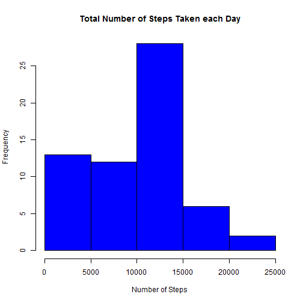
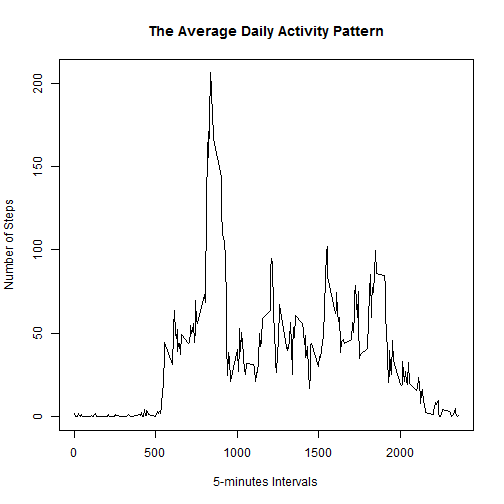
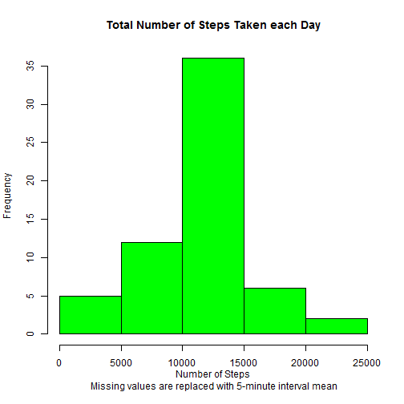
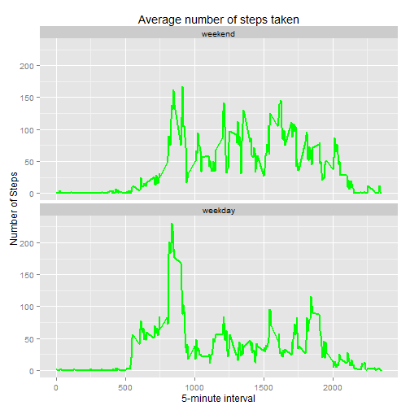

# Reproducible Research: Peer Assessment 1  

*Monday, 8 June 2015*

-------------------------------------------------------------------------------

## Introduction

This report is created during the 1st Peer Assessment within Reproducible Research Coursera Course by John Hopkins Bloomberg School of Public Health.

This assignment makes use of data from a personal activity monitoring device.
This device collects data at 5 minute intervals through out the day. The data
consists of two months of data from an anonymous individual collected during
the months of October and November, 2012 and include the number of steps
taken in 5 minute intervals each day.

-------------------------------------------------------------------------------

## Data
The data for this assignment can be downloaded from the course web site in a zipped file:

- **Dataset**: [Activity monitoring data (52K)](https://d396qusza40orc.cloudfront.net/repdata%2Fdata%2Factivity.zip)

The variables included in this dataset are:

- **steps**: Number of steps taking in a 5-minute interval (missing values are
coded as NA)

- **date**: The date on which the measurement was taken in YYYY-MM-DD
format

- **interval**: Identifier for the 5-minute interval in which measurement was
taken

The dataset is stored in a comma-separated-value (CSV) file and there are a
total of 17,568 observations in this dataset.

To data is also available in .zip format within the [GitHub repository created for this assignment](http://github.com/rdpeng/RepData_PeerAssessment1), which was forked and cloned into the working directory.

The data is in a .zip file format and has to be extracted into the working directory to complete this assessment.

-------------------------------------------------------------------------------

## Loading and preprocessing the data

1. The Activity monitoring data is read using the read.csv() function into R:


```r
activityData <- read.csv("activity.csv")
```

The data set has the following characteristics:


```r
dim(activityData)
```

```
## [1] 17568     3
```

```r
head(activityData)
```

```
##   steps       date interval
## 1    NA 2012-10-01        0
## 2    NA 2012-10-01        5
## 3    NA 2012-10-01       10
## 4    NA 2012-10-01       15
## 5    NA 2012-10-01       20
## 6    NA 2012-10-01       25
```

```r
tail(activityData)
```

```
##       steps       date interval
## 17563    NA 2012-11-30     2330
## 17564    NA 2012-11-30     2335
## 17565    NA 2012-11-30     2340
## 17566    NA 2012-11-30     2345
## 17567    NA 2012-11-30     2350
## 17568    NA 2012-11-30     2355
```

```r
str(activityData)
```

```
## 'data.frame':	17568 obs. of  3 variables:
##  $ steps   : int  NA NA NA NA NA NA NA NA NA NA ...
##  $ date    : Factor w/ 61 levels "2012-10-01","2012-10-02",..: 1 1 1 1 1 1 1 1 1 1 ...
##  $ interval: int  0 5 10 15 20 25 30 35 40 45 ...
```

```r
summary(activityData)
```

```
##      steps                date          interval     
##  Min.   :  0.00   2012-10-01:  288   Min.   :   0.0  
##  1st Qu.:  0.00   2012-10-02:  288   1st Qu.: 588.8  
##  Median :  0.00   2012-10-03:  288   Median :1177.5  
##  Mean   : 37.38   2012-10-04:  288   Mean   :1177.5  
##  3rd Qu.: 12.00   2012-10-05:  288   3rd Qu.:1766.2  
##  Max.   :806.00   2012-10-06:  288   Max.   :2355.0  
##  NA's   :2304     (Other)   :15840
```

2. Process/transform the data (if necessary) into a format suitable for your analysis.

The dataset is tidy and contains all the information required for the assessment.

-------------------------------------------------------------------------------

## What is mean total number of steps taken per day?

1. Calculate the total number of steps taken per day using dplyr R Package:


```r
library(dplyr)
```

```
## 
## Attaching package: 'dplyr'
## 
## The following object is masked from 'package:stats':
## 
##     filter
## 
## The following objects are masked from 'package:base':
## 
##     intersect, setdiff, setequal, union
```

```r
activityByDays <- group_by(activityData, date)
totalStepsD <- summarize(activityByDays, stepsTotal = sum(steps, na.rm=TRUE))
totalStepsD
```

```
## Source: local data frame [61 x 2]
## 
##          date stepsTotal
## 1  2012-10-01          0
## 2  2012-10-02        126
## 3  2012-10-03      11352
## 4  2012-10-04      12116
## 5  2012-10-05      13294
## 6  2012-10-06      15420
## 7  2012-10-07      11015
## 8  2012-10-08          0
## 9  2012-10-09      12811
## 10 2012-10-10       9900
## ..        ...        ...
```

2. Make a histogram of the total number of steps taken each day:


```r
hist(totalStepsD$stepsTotal,
             main="Total Number of Steps Taken each Day",
             xlab="Number of Steps",
             col="Blue")
```

 

3. Calculate and report the mean and median of the total number of steps taken per day:


```r
stepsTMeanD <- round(mean(totalStepsD$stepsTotal), digits = 0)
stepsTMedianD <- round(median(totalStepsD$stepsTotal), digits = 0)
```

The **mean** of total steps taken by days is **9354** and the **median** is **1.0395 &times; 10<sup>4</sup>**.

-------------------------------------------------------------------------------

## What is the average daily activity pattern?

1. Make a time series plot (i.e. type = "l") of the 5-minute interval (x-axis) and the average number of steps taken, averaged across all days (y-axis).

Calculating the average steps of the 5-minute intervals:


```r
activityByIntervals <- group_by(activityData, interval)
averageStepsInt <- summarize(activityByIntervals, stepsAverage = mean(steps, na.rm=TRUE))
averageStepsInt
```

```
## Source: local data frame [288 x 2]
## 
##    interval stepsAverage
## 1         0    1.7169811
## 2         5    0.3396226
## 3        10    0.1320755
## 4        15    0.1509434
## 5        20    0.0754717
## 6        25    2.0943396
## 7        30    0.5283019
## 8        35    0.8679245
## 9        40    0.0000000
## 10       45    1.4716981
## ..      ...          ...
```

Make a time series plot to visualize the result:


```r
 plot(averageStepsInt$interval, averageStepsInt$stepsAverage,
             type="l",
             main="The Average Daily Activity Pattern",
             xlab="5-minutes Intervals",
             ylab="Number of Steps"
        )
```

 

2. Which 5-minute interval, on average across all the days in the dataset, contains the maximum number of steps?

Calculating the maximum umber of average steps across all the days and selecting the respective 5-minute interval:


```r
maxSteps <- max(averageStepsInt$stepsAverage)
roundMaxSteps <- round(maxSteps, digits = 2)
maxInterval <- subset(averageStepsInt, stepsAverage == maxSteps, interval)
```

The maximum number of average steps across all the days is **206.17** in the **835** 5-minute interval.

-------------------------------------------------------------------------------

## Imputing missing values

Note that there are a number of days/intervals where there are missing values (coded as NA). The presence of missing days may introduce bias into some calculations or summaries of the data.

1. Calculate and report the total number of missing values in the dataset (i.e. the total number of rows with NAs)


```r
missingSteps <- sum(colSums(is.na(activityData)))
```

There are **2304** missing values within the activity monitoring data set.

2. Devise a strategy for filling in all of the missing values in the dataset. The strategy does not need to be sophisticated. For example, you could use the mean/median for that day, or the mean for that 5-minute interval, etc.

The selected startegy is using the mean for that 5-minute interval where the value is missing to replace missing value, NA with the mean value.

3. Create a new dataset that is equal to the original dataset but with the missing data filled in.

Merging activityData and averageStepsInt datasets by interval values, including a new column with the 5-minute mean value into the dataset:


```r
activityDataAve <- merge(activityData, averageStepsInt, by = "interval")
head(activityDataAve)
```

```
##   interval steps       date stepsAverage
## 1        0    NA 2012-10-01     1.716981
## 2        0     0 2012-11-23     1.716981
## 3        0     0 2012-10-28     1.716981
## 4        0     0 2012-11-06     1.716981
## 5        0     0 2012-11-24     1.716981
## 6        0     0 2012-11-15     1.716981
```

```r
tail(activityDataAve)
```

```
##       interval steps       date stepsAverage
## 17563     2355     0 2012-10-16     1.075472
## 17564     2355     0 2012-10-07     1.075472
## 17565     2355     0 2012-10-25     1.075472
## 17566     2355     0 2012-11-03     1.075472
## 17567     2355    NA 2012-10-08     1.075472
## 17568     2355    NA 2012-11-30     1.075472
```

Identifying the rows where NAs are present:


```r
NASelection <- is.na(activityDataAve$steps)
head(NASelection)
```

```
## [1]  TRUE FALSE FALSE FALSE FALSE FALSE
```

```r
tail(NASelection)
```

```
## [1] FALSE FALSE FALSE FALSE  TRUE  TRUE
```

Replacing the NAs with the rounded mean (stepsAverage) value:


```r
activityDataAve[NASelection, 2] <- round(activityDataAve[NASelection, 4], digits = 0)
head(activityDataAve)
```

```
##   interval steps       date stepsAverage
## 1        0     2 2012-10-01     1.716981
## 2        0     0 2012-11-23     1.716981
## 3        0     0 2012-10-28     1.716981
## 4        0     0 2012-11-06     1.716981
## 5        0     0 2012-11-24     1.716981
## 6        0     0 2012-11-15     1.716981
```

```r
tail(activityDataAve)
```

```
##       interval steps       date stepsAverage
## 17563     2355     0 2012-10-16     1.075472
## 17564     2355     0 2012-10-07     1.075472
## 17565     2355     0 2012-10-25     1.075472
## 17566     2355     0 2012-11-03     1.075472
## 17567     2355     1 2012-10-08     1.075472
## 17568     2355     1 2012-11-30     1.075472
```

Transforming the dataset to be in the identical format as the original activity monitoring data set:


```r
activityDataNew <- arrange(activityDataAve[c(2, 3, 1)], date, interval)
head(activityData)
```

```
##   steps       date interval
## 1    NA 2012-10-01        0
## 2    NA 2012-10-01        5
## 3    NA 2012-10-01       10
## 4    NA 2012-10-01       15
## 5    NA 2012-10-01       20
## 6    NA 2012-10-01       25
```

```r
head(activityDataNew)
```

```
##   steps       date interval
## 1     2 2012-10-01        0
## 2     0 2012-10-01        5
## 3     0 2012-10-01       10
## 4     0 2012-10-01       15
## 5     0 2012-10-01       20
## 6     2 2012-10-01       25
```

```r
tail(activityData)
```

```
##       steps       date interval
## 17563    NA 2012-11-30     2330
## 17564    NA 2012-11-30     2335
## 17565    NA 2012-11-30     2340
## 17566    NA 2012-11-30     2345
## 17567    NA 2012-11-30     2350
## 17568    NA 2012-11-30     2355
```

```r
tail(activityDataNew)
```

```
##       steps       date interval
## 17563     3 2012-11-30     2330
## 17564     5 2012-11-30     2335
## 17565     3 2012-11-30     2340
## 17566     1 2012-11-30     2345
## 17567     0 2012-11-30     2350
## 17568     1 2012-11-30     2355
```

Now **activityDataNew** dataset has the same format as the **activityData** dataset, the only difference is the filled missing values with the rounded mean for the respective 5-minute intervals.

4. Make a histogram of the total number of steps taken each day and Calculate and report the mean and median total number of steps taken per day. Do these values differ from the estimates from the first part of the assignment? What is the impact of imputing missing data on the estimates of the total daily number of steps?

Calculate the new total number of steps taken per day:


```r
activityByDaysNew <- group_by(activityDataNew, date)
totalStepsDNew <- summarize(activityByDaysNew, stepsTotal = sum(steps, na.rm=TRUE))
totalStepsDNew
```

```
## Source: local data frame [61 x 2]
## 
##          date stepsTotal
## 1  2012-10-01      10762
## 2  2012-10-02        126
## 3  2012-10-03      11352
## 4  2012-10-04      12116
## 5  2012-10-05      13294
## 6  2012-10-06      15420
## 7  2012-10-07      11015
## 8  2012-10-08      10762
## 9  2012-10-09      12811
## 10 2012-10-10       9900
## ..        ...        ...
```

Make a histogram of the total number of steps taken each day:


```r
hist(totalStepsDNew$stepsTotal,
             main="Total Number of Steps Taken each Day",
             xlab="Number of Steps\n Missing values are replaced with 5-minute interval mean",
             col="Green")
```

 

The new histogram shows, that filling missing values resulted a lower number of days with steps between 0 and 5000, and increased the number of days where the steps number is between 10000 and 15000.

Calculate and report the mean and median of the new total number of steps taken per day:


```r
stepsTMeanDNew <- round(mean(totalStepsDNew$stepsTotal), digits = 0)
stepsTMedianDNew <- round(median(totalStepsDNew$stepsTotal), digits = 0)
```

The **mean** of total steps taken by days is **1.0766 &times; 10<sup>4</sup>** (originally it was 9354)
and the **median** is **1.0762 &times; 10<sup>4</sup>** (originally it was 1.0395 &times; 10<sup>4</sup>).


The new dataset mean and median values are increased and get closer to each other. 

-------------------------------------------------------------------------------

## Are there differences in activity patterns between weekdays and weekends?

For this part the weekdays() function may be of some help here. Use the dataset with the filled-in missing values for this part.

1. Create a new factor variable in the dataset with two levels - "weekday" and "weekend" indicating whether a given date is a weekday or weekend day.

Changing the class of the date column:


```r
activityDataNew$date <- as.Date(activityDataNew$date)
class(activityDataNew$date)
```

```
## [1] "Date"
```

```r
head(activityDataNew$date)
```

```
## [1] "2012-10-01" "2012-10-01" "2012-10-01" "2012-10-01" "2012-10-01"
## [6] "2012-10-01"
```

Add new column with weekday factor using timeDate package:


```r
install.packages("timeDate", repos = "http://cran.us.r-project.org")
```

```
## Installing package into 'C:/Users/HP/Documents/R/win-library/3.1'
## (as 'lib' is unspecified)
```

```
## package 'timeDate' successfully unpacked and MD5 sums checked
## 
## The downloaded binary packages are in
## 	C:\Users\HP\AppData\Local\Temp\Rtmpqwd63p\downloaded_packages
```

```r
library(timeDate)
activityDataNew$wdFactor <- factor(isWeekday(activityDataNew$date))
levels(activityDataNew$wdFactor)[levels(activityDataNew$wdFactor) == "TRUE"] <- "weekday"
levels(activityDataNew$wdFactor)[levels(activityDataNew$wdFactor) == "FALSE"] <- "weekend"
head(activityDataNew)
```

```
##   steps       date interval wdFactor
## 1     2 2012-10-01        0  weekday
## 2     0 2012-10-01        5  weekday
## 3     0 2012-10-01       10  weekday
## 4     0 2012-10-01       15  weekday
## 5     0 2012-10-01       20  weekday
## 6     2 2012-10-01       25  weekday
```

```r
tail(activityDataNew)
```

```
##       steps       date interval wdFactor
## 17563     3 2012-11-30     2330  weekday
## 17564     5 2012-11-30     2335  weekday
## 17565     3 2012-11-30     2340  weekday
## 17566     1 2012-11-30     2345  weekday
## 17567     0 2012-11-30     2350  weekday
## 17568     1 2012-11-30     2355  weekday
```

```r
str(activityDataNew)
```

```
## 'data.frame':	17568 obs. of  4 variables:
##  $ steps   : num  2 0 0 0 0 2 1 1 0 1 ...
##  $ date    : Date, format: "2012-10-01" "2012-10-01" ...
##  $ interval: int  0 5 10 15 20 25 30 35 40 45 ...
##  $ wdFactor: Factor w/ 2 levels "weekend","weekday": 2 2 2 2 2 2 2 2 2 2 ...
```

2. Make a panel plot containing a time series plot (i.e. type = "l") of the 5-minute interval (x-axis) and the average number of steps taken, averaged across all weekday days or weekend days (y-axis). You can make the plot using any plotting system you choose.

Calculating the the average number of steps taken, averaged across all weekday days or weekend days:


```r
stepsActivityDataNewA <- aggregate(steps ~ wdFactor + interval, activityDataNew, mean)
head(stepsActivityDataNewA)
```

```
##   wdFactor interval     steps
## 1  weekend        0 0.2500000
## 2  weekday        0 2.2888889
## 3  weekend        5 0.0000000
## 4  weekday        5 0.4000000
## 5  weekend       10 0.0000000
## 6  weekday       10 0.1555556
```

```r
tail(stepsActivityDataNewA)
```

```
##     wdFactor interval     steps
## 571  weekend     2345 1.7500000
## 572  weekday     2345 0.3111111
## 573  weekend     2350 0.0000000
## 574  weekday     2350 0.2666667
## 575  weekend     2355 0.1250000
## 576  weekday     2355 1.4000000
```

```r
dim(stepsActivityDataNewA)
```

```
## [1] 576   3
```

Create panel plot to present the result:


```r
library(ggplot2)
ggplot(stepsActivityDataNewA, aes(interval, steps)) + geom_line(color = "green", lwd = 1) + facet_wrap(~ wdFactor, ncol = 1) + labs(title = "Average number of steps taken") + xlab("5-minute interval") + ylab("Number of Steps")
```

 

The maximum average number of steps is taken on weekdays. During weekends the activity starts later in the morning, however the average number of steps through the day is higher than on weekdays.

-------------------------------------------------------------------------------
